# Architecture Diagrams

Visual diagrams of PartnerForge system architecture using Mermaid.

---

## System Overview

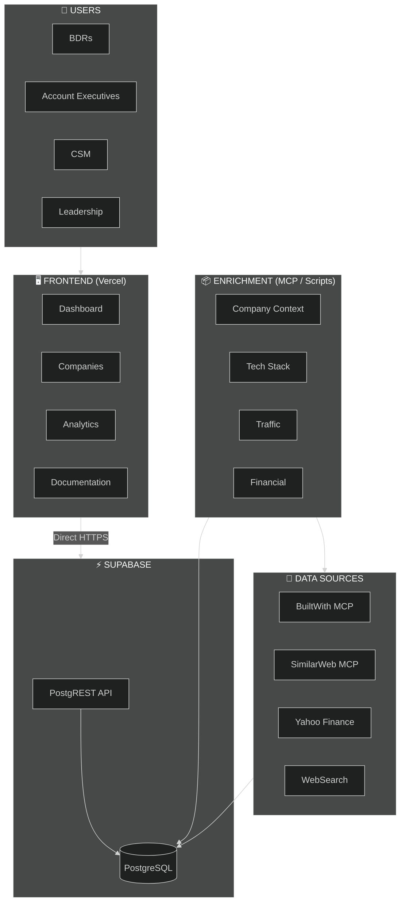

---

## 4-Wave Parallel Execution Model

```mermaid
%%{init: {'theme': 'dark'}}%%
flowchart LR
    subgraph W1["WAVE 1 - Foundation (Parallel)"]
        direction TB
        M01[M01: Company Context]
        M02[M02: Tech Stack]
        M03[M03: Traffic Analysis]
        M04[M04: Financial Profile]
    end

    subgraph W2["WAVE 2 - Competitive (Parallel)"]
        direction TB
        M05[M05: Competitor Intel]
        M06[M06: Hiring Signals]
        M07[M07: Strategic Context]
    end

    subgraph W3["WAVE 3 - Buying Signals (Parallel)"]
        direction TB
        M08[M08: Investor Intel]
        M09[M09: Executive Intel]
        M10[M10: Buying Committee]
        M11[M11: Displacement Analysis]
    end

    subgraph W4["WAVE 4 - Synthesis (Parallel)"]
        direction TB
        M12[M12: Case Study Match]
        M13[M13: ICP-Priority Map]
        M14[M14: Signal Scoring]
        M15[M15: Strategic Brief]
    end

    W1 --> |JOIN BARRIER| W2
    W2 --> |JOIN BARRIER| W3
    W3 --> |JOIN BARRIER| W4
    W4 --> Output[📊 Dashboard + Reports]

    style W1 fill:#003dff,color:#fff
    style W2 fill:#5468ff,color:#fff
    style W3 fill:#8099ff,color:#000
    style W4 fill:#b3c2ff,color:#000
```

---

## Data Flow Diagram

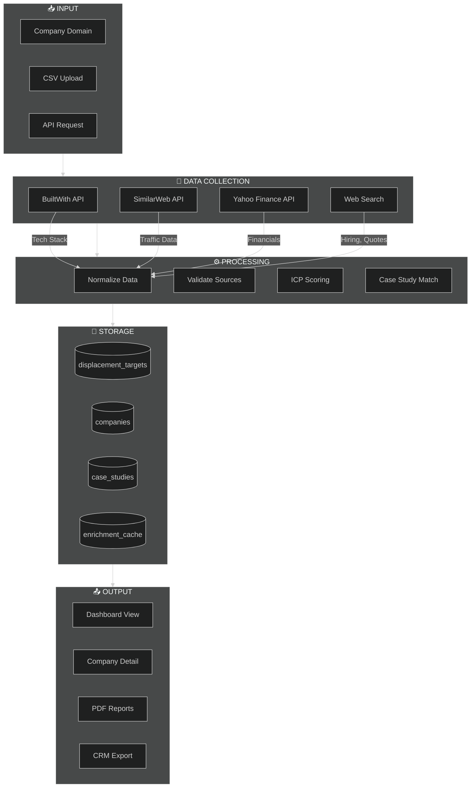

---

## ICP Scoring Flow

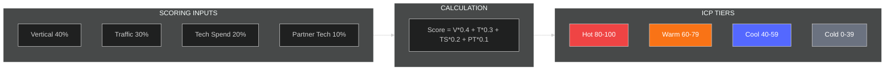

---

## Module Dependency Graph

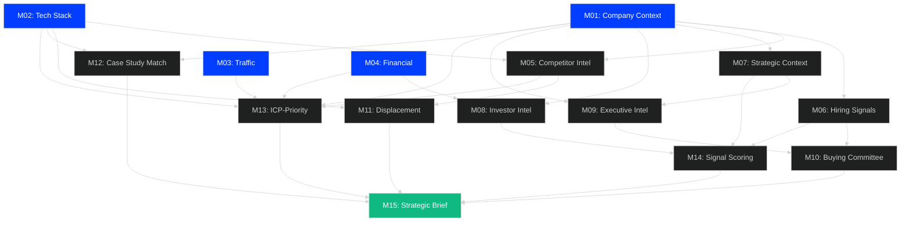

---

## Database Entity Relationship

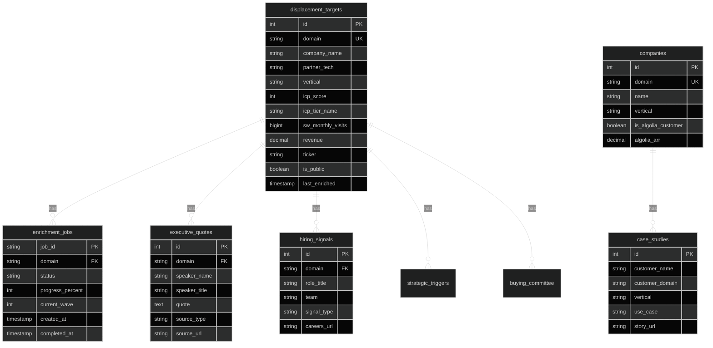

---

## Enrichment Job State Machine

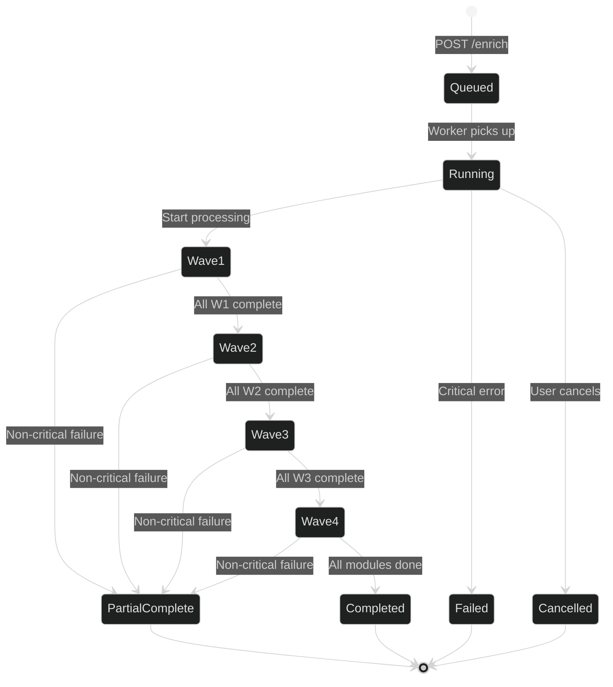

---

## Frontend Component Hierarchy

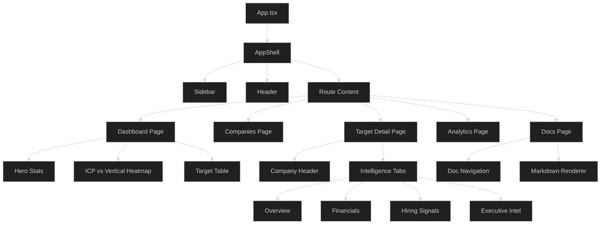

---

## API Request Flow

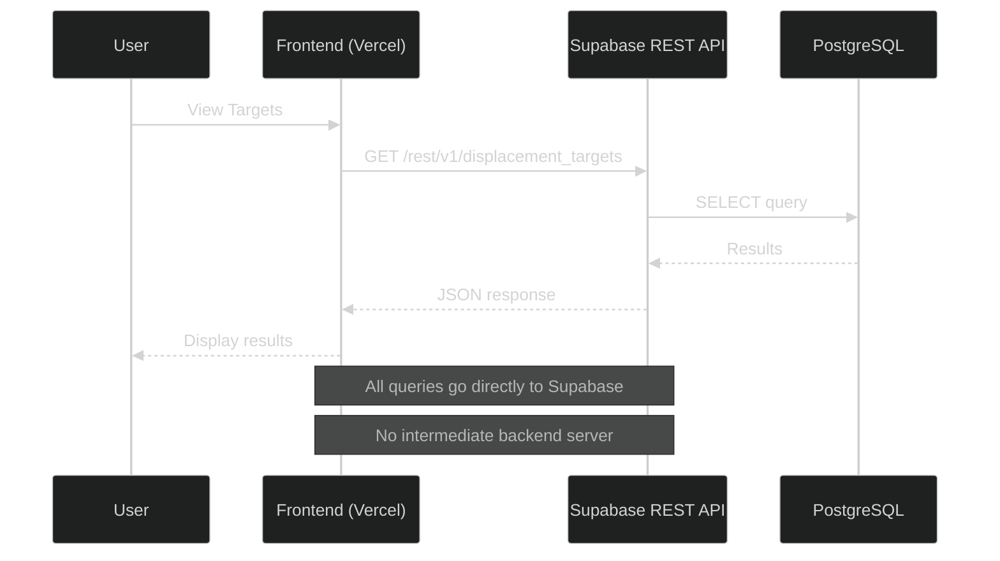

---

## Enrichment Flow (Offline/MCP)

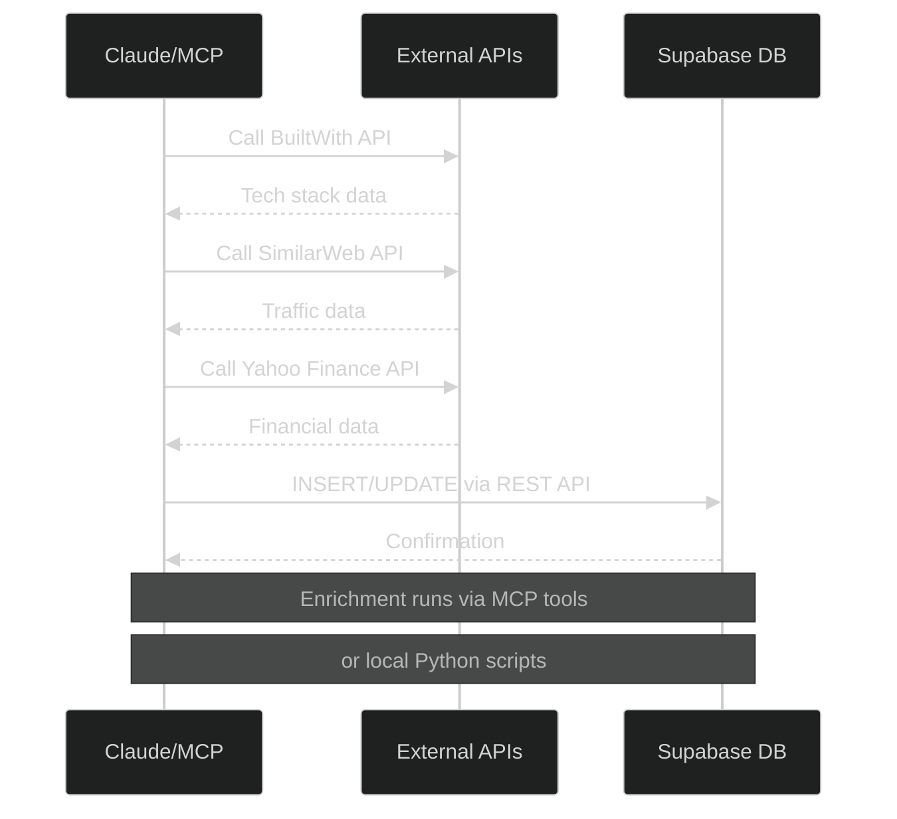

---

## Deployment Architecture

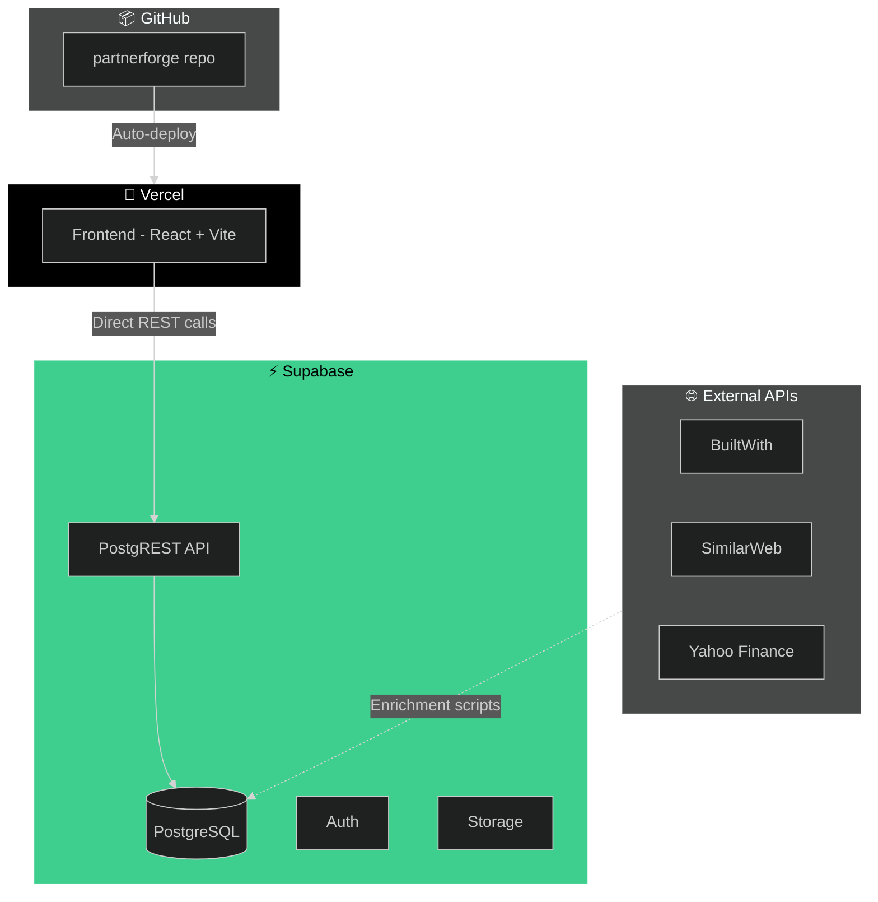

---

## Circuit Breaker Pattern

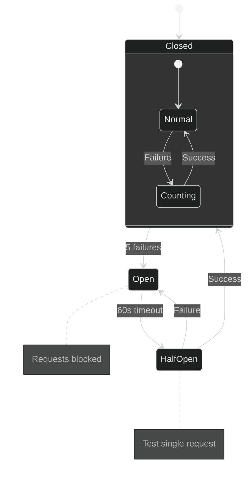

---

## Build Process - Parallel Agent Strategy

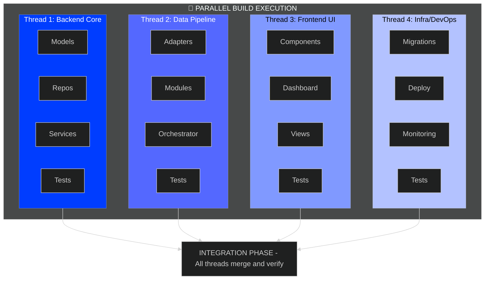

---

## 15 Intelligence Modules Overview

| Wave | Module | Description | Data Source |
|------|--------|-------------|-------------|
| **1** | M01 | Company Context | BuiltWith |
| **1** | M02 | Tech Stack | BuiltWith |
| **1** | M03 | Traffic Analysis | SimilarWeb |
| **1** | M04 | Financial Profile | Yahoo Finance |
| **2** | M05 | Competitor Intel | SimilarWeb |
| **2** | M06 | Hiring Signals | WebSearch |
| **2** | M07 | Strategic Context | WebSearch |
| **3** | M08 | Investor Intel | SEC/WebSearch |
| **3** | M09 | Executive Intel | WebSearch |
| **3** | M10 | Buying Committee | LinkedIn |
| **3** | M11 | Displacement Analysis | Internal |
| **4** | M12 | Case Study Matching | Internal DB |
| **4** | M13 | ICP-Priority Mapping | Internal |
| **4** | M14 | Signal Scoring | Internal |
| **4** | M15 | Strategic Brief | AI Generated |

---

## Related Documents

- [Parallel Execution Architecture](../PARALLEL_EXECUTION_ARCHITECTURE.md)
- [Enterprise Architecture](../ENTERPRISE-ARCHITECTURE.md)
- [Database Schema](./database.md)
- [Architecture Index](../ARCHITECTURE_INDEX.md)

---

*Generated with Mermaid diagrams for GitHub/GitLab rendering*
