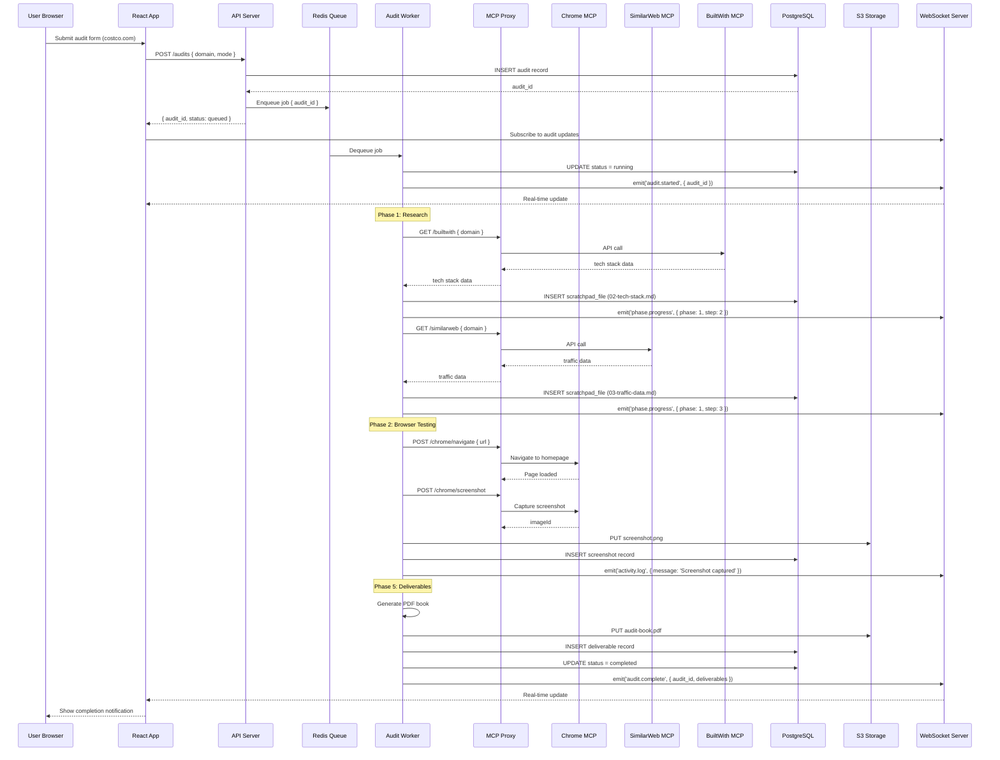
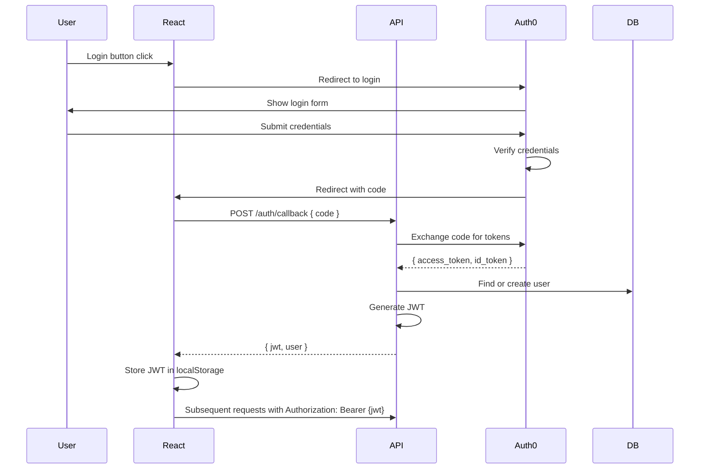
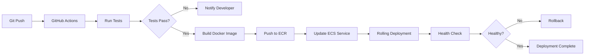

# Algolia Search Audit Dashboard — Logical Architecture

**Date**: March 2, 2026

---

## System Architecture Overview

```mermaid
graph TB
    subgraph "Client Layer"
        WEB[Web Browser]
        MOBILE[Mobile Browser]
    end

    subgraph "CDN Layer"
        CDN[CloudFront CDN]
    end

    subgraph "Frontend Application"
        REACT[React App<br/>TypeScript + Tailwind]
        ROUTER[React Router]
        QUERY[React Query<br/>Data Fetching]
        WS_CLIENT[Socket.IO Client<br/>Real-Time Updates]
        STATE[Zustand<br/>Global State]
    end

    subgraph "API Layer"
        LB[Load Balancer]
        API1[API Server 1<br/>Node.js/Express]
        API2[API Server 2<br/>Node.js/Express]
        API3[API Server 3<br/>Node.js/Express]
        AUTH[Auth Middleware<br/>JWT]
    end

    subgraph "WebSocket Layer"
        WS1[WebSocket Server 1<br/>Socket.IO]
        WS2[WebSocket Server 2<br/>Socket.IO]
        REDIS_ADAPTER[Redis Adapter<br/>Cross-Server Sync]
    end

    subgraph "Background Jobs"
        QUEUE[Redis/Bull Queue]
        WORKER1[Worker 1<br/>Audit Orchestrator]
        WORKER2[Worker 2<br/>Audit Orchestrator]
        WORKER3[Worker 3<br/>Audit Orchestrator]
    end

    subgraph "MCP Proxy Layer"
        MCP_PROXY[MCP Proxy Service<br/>Connection Pool]
        CHROME_POOL[Chrome MCP<br/>Connection Pool]
        SW_POOL[SimilarWeb MCP<br/>Connection Pool]
        BW_POOL[BuiltWith MCP<br/>Connection Pool]
    end

    subgraph "External MCP Servers"
        CHROME[Chrome MCP<br/>Browser Automation]
        SIMILARWEB[SimilarWeb MCP<br/>Traffic Data]
        BUILTWITH[BuiltWith MCP<br/>Technology Stack]
        YAHOO[Yahoo Finance MCP<br/>Financial Data]
        EDGAR[SEC EDGAR MCP<br/>Investor Filings]
    end

    subgraph "Database Layer"
        PG_PRIMARY[PostgreSQL<br/>Primary]
        PG_REPLICA[PostgreSQL<br/>Read Replica]
    end

    subgraph "Cache Layer"
        REDIS_CACHE[Redis Cache<br/>Sessions + Data]
    end

    subgraph "Storage Layer"
        S3[S3 Bucket<br/>PDFs, Screenshots]
    end

    subgraph "Monitoring & Logging"
        LOGS[CloudWatch Logs]
        METRICS[CloudWatch Metrics]
        ALERTS[PagerDuty Alerts]
    end

    %% Client to CDN
    WEB --> CDN
    MOBILE --> CDN

    %% CDN to Frontend
    CDN --> REACT

    %% Frontend Components
    REACT --> ROUTER
    REACT --> QUERY
    REACT --> WS_CLIENT
    REACT --> STATE

    %% Frontend to API
    QUERY --> LB

    %% Load Balancer to API Servers
    LB --> API1
    LB --> API2
    LB --> API3

    %% Auth
    API1 --> AUTH
    API2 --> AUTH
    API3 --> AUTH

    %% API to Database
    API1 --> PG_PRIMARY
    API2 --> PG_PRIMARY
    API3 --> PG_PRIMARY
    API1 --> PG_REPLICA
    API2 --> PG_REPLICA
    API3 --> PG_REPLICA

    %% API to Cache
    API1 --> REDIS_CACHE
    API2 --> REDIS_CACHE
    API3 --> REDIS_CACHE

    %% API to Queue
    API1 --> QUEUE
    API2 --> QUEUE
    API3 --> QUEUE

    %% API to Storage
    API1 --> S3
    API2 --> S3
    API3 --> S3

    %% WebSocket Connections
    WS_CLIENT --> WS1
    WS_CLIENT --> WS2
    WS1 --> REDIS_ADAPTER
    WS2 --> REDIS_ADAPTER

    %% Queue to Workers
    QUEUE --> WORKER1
    QUEUE --> WORKER2
    QUEUE --> WORKER3

    %% Workers to MCP Proxy
    WORKER1 --> MCP_PROXY
    WORKER2 --> MCP_PROXY
    WORKER3 --> MCP_PROXY

    %% MCP Proxy to Connection Pools
    MCP_PROXY --> CHROME_POOL
    MCP_PROXY --> SW_POOL
    MCP_PROXY --> BW_POOL

    %% Connection Pools to MCP Servers
    CHROME_POOL --> CHROME
    SW_POOL --> SIMILARWEB
    BW_POOL --> BUILTWITH
    MCP_PROXY --> YAHOO
    MCP_PROXY --> EDGAR

    %% Workers to Database
    WORKER1 --> PG_PRIMARY
    WORKER2 --> PG_PRIMARY
    WORKER3 --> PG_PRIMARY

    %% Workers to Storage
    WORKER1 --> S3
    WORKER2 --> S3
    WORKER3 --> S3

    %% Workers to WebSocket (progress updates)
    WORKER1 --> WS1
    WORKER2 --> WS1
    WORKER3 --> WS2

    %% Monitoring
    API1 --> LOGS
    API2 --> LOGS
    API3 --> LOGS
    WORKER1 --> LOGS
    WORKER2 --> LOGS
    WORKER3 --> LOGS

    API1 --> METRICS
    WORKER1 --> METRICS

    METRICS --> ALERTS

    style WEB fill:#EFF6FF
    style REACT fill:#5468FF,color:#fff
    style API1 fill:#003DFF,color:#fff
    style API2 fill:#003DFF,color:#fff
    style API3 fill:#003DFF,color:#fff
    style QUEUE fill:#10B981,color:#fff
    style WORKER1 fill:#10B981,color:#fff
    style WORKER2 fill:#10B981,color:#fff
    style WORKER3 fill:#10B981,color:#fff
    style PG_PRIMARY fill:#21243D,color:#fff
    style S3 fill:#FF9900,color:#fff
```



---

## Data Flow: Full Audit Execution



---

## Component Architecture

### Frontend (React)

```
src/
├── components/
│   ├── Dashboard/
│   │   ├── DashboardHome.tsx
│   │   ├── AuditCard.tsx
│   │   ├── QuickStart.tsx
│   │   └── SystemStatus.tsx
│   ├── Wizard/
│   │   ├── WizardContainer.tsx
│   │   ├── Step1CompanyInput.tsx
│   │   ├── Step2ModeSelection.tsx
│   │   ├── Step3Configuration.tsx
│   │   └── Step4Review.tsx
│   ├── AuditDetail/
│   │   ├── AuditDetailLayout.tsx
│   │   ├── OverviewTab.tsx
│   │   ├── ResearchTab.tsx
│   │   ├── BrowserTestsTab.tsx
│   │   ├── ScoringTab.tsx
│   │   └── DeliverablesTab.tsx
│   ├── Library/
│   │   ├── LibraryView.tsx
│   │   ├── AuditGrid.tsx
│   │   └── FilterPanel.tsx
│   └── Settings/
│       ├── McpServerStatus.tsx
│       ├── ApiCredits.tsx
│       └── UserPreferences.tsx
├── hooks/
│   ├── useAudit.ts          // React Query hook for audit data
│   ├── useWebSocket.ts      // Socket.IO connection management
│   └── useAuditProgress.ts  // Real-time progress updates
├── services/
│   ├── api.ts               // Axios instance + endpoints
│   ├── websocket.ts         // Socket.IO client
│   └── auth.ts              // JWT management
└── store/
    ├── auditStore.ts        // Zustand store for audit queue
    └── userStore.ts         // User session state
```

### Backend (Node.js/Express)

```
server/
├── routes/
│   ├── audits.ts            // CRUD operations
│   ├── scratchpad.ts        // Read/edit scratchpad files
│   ├── deliverables.ts      // Download/share endpoints
│   └── mcp.ts               // MCP health checks
├── services/
│   ├── auditOrchestrator.ts // Main audit execution logic
│   ├── mcpProxy.ts          // MCP connection management
│   ├── pdfGenerator.ts      // HTML → PDF conversion
│   └── websocket.ts         // Socket.IO server
├── workers/
│   ├── auditWorker.ts       // Bull queue worker
│   └── phase1Worker.ts      // Agent Teams parallel execution
├── models/
│   ├── Audit.ts
│   ├── AuditPhase.ts
│   ├── ScratchpadFile.ts
│   ├── Screenshot.ts
│   └── Deliverable.ts
└── middleware/
    ├── auth.ts              // JWT verification
    ├── rateLimit.ts         // API rate limiting
    └── errorHandler.ts      // Centralized error handling
```

---

## Technology Stack

### Frontend
| Layer | Technology | Purpose |
|-------|-----------|---------|
| UI Framework | React 18 | Component-based UI |
| Language | TypeScript | Type safety |
| Styling | Tailwind CSS | Utility-first CSS |
| Component Library | shadcn/ui | Pre-built components |
| Routing | React Router v6 | Client-side routing |
| State Management | Zustand | Global state (lightweight) |
| Server State | TanStack Query (React Query) | API data fetching/caching |
| Real-Time | Socket.IO Client | WebSocket connections |
| Forms | React Hook Form + Zod | Form handling + validation |
| Charts | Recharts | Data visualizations |

### Backend
| Layer | Technology | Purpose |
|-------|-----------|---------|
| Runtime | Node.js 20 | JavaScript runtime |
| Framework | Express.js | Web framework |
| Language | TypeScript | Type safety |
| Database | PostgreSQL 16 | Relational database |
| ORM | Prisma | Database queries |
| Cache | Redis 7 | Caching + session store |
| Queue | Bull | Background job processing |
| WebSocket | Socket.IO | Real-time updates |
| File Storage | AWS S3 | PDFs, screenshots |
| Authentication | JWT | Token-based auth |
| PDF Generation | Puppeteer | HTML → PDF conversion |

### Infrastructure
| Layer | Technology | Purpose |
|-------|-----------|---------|
| Hosting | AWS ECS Fargate | Containerized apps |
| CDN | CloudFront | Static asset delivery |
| Load Balancer | ALB | Traffic distribution |
| Monitoring | CloudWatch | Logs + metrics |
| Alerts | PagerDuty | On-call alerting |
| CI/CD | GitHub Actions | Automated deployments |
| Secrets | AWS Secrets Manager | API keys, DB credentials |

---

## Database Schema

```sql
-- Core Tables

CREATE TABLE users (
    id UUID PRIMARY KEY DEFAULT gen_random_uuid(),
    email VARCHAR(255) UNIQUE NOT NULL,
    name VARCHAR(255) NOT NULL,
    role VARCHAR(50) NOT NULL CHECK (role IN ('viewer', 'editor', 'admin')),
    created_at TIMESTAMP DEFAULT NOW(),
    updated_at TIMESTAMP DEFAULT NOW()
);

CREATE TABLE audits (
    id UUID PRIMARY KEY DEFAULT gen_random_uuid(),
    user_id UUID REFERENCES users(id) ON DELETE SET NULL,
    domain VARCHAR(255) NOT NULL,
    company_name VARCHAR(255),
    vertical VARCHAR(100),
    status VARCHAR(50) NOT NULL CHECK (status IN ('queued', 'running', 'paused', 'completed', 'failed')),
    current_phase INT CHECK (current_phase BETWEEN 0 AND 5),
    current_step VARCHAR(100),
    progress_pct INT CHECK (progress_pct BETWEEN 0 AND 100),
    overall_score DECIMAL(3,1) CHECK (overall_score BETWEEN 0 AND 10),
    error_message TEXT,
    created_at TIMESTAMP DEFAULT NOW(),
    updated_at TIMESTAMP DEFAULT NOW(),
    INDEX idx_status (status),
    INDEX idx_user_id (user_id),
    INDEX idx_domain (domain)
);

CREATE TABLE audit_phases (
    id UUID PRIMARY KEY DEFAULT gen_random_uuid(),
    audit_id UUID REFERENCES audits(id) ON DELETE CASCADE,
    phase_num INT NOT NULL CHECK (phase_num BETWEEN 0 AND 5),
    status VARCHAR(50) NOT NULL CHECK (status IN ('pending', 'running', 'completed', 'failed')),
    started_at TIMESTAMP,
    completed_at TIMESTAMP,
    duration_seconds INT,
    error_message TEXT,
    INDEX idx_audit_id (audit_id)
);

CREATE TABLE audit_scratchpad_files (
    id UUID PRIMARY KEY DEFAULT gen_random_uuid(),
    audit_id UUID REFERENCES audits(id) ON DELETE CASCADE,
    file_name VARCHAR(255) NOT NULL,
    content TEXT NOT NULL,
    created_at TIMESTAMP DEFAULT NOW(),
    updated_at TIMESTAMP DEFAULT NOW(),
    INDEX idx_audit_id (audit_id),
    UNIQUE (audit_id, file_name)
);

CREATE TABLE audit_screenshots (
    id UUID PRIMARY KEY DEFAULT gen_random_uuid(),
    audit_id UUID REFERENCES audits(id) ON DELETE CASCADE,
    file_name VARCHAR(255) NOT NULL,
    s3_url VARCHAR(500) NOT NULL,
    step_name VARCHAR(255),
    created_at TIMESTAMP DEFAULT NOW(),
    INDEX idx_audit_id (audit_id)
);

CREATE TABLE audit_deliverables (
    id UUID PRIMARY KEY DEFAULT gen_random_uuid(),
    audit_id UUID REFERENCES audits(id) ON DELETE CASCADE,
    deliverable_type VARCHAR(50) NOT NULL CHECK (deliverable_type IN ('pdf_book', 'ae_brief', 'signal_brief')),
    s3_url VARCHAR(500) NOT NULL,
    file_size_bytes BIGINT NOT NULL,
    page_count INT,
    created_at TIMESTAMP DEFAULT NOW(),
    INDEX idx_audit_id (audit_id)
);

-- MCP Server Status Tracking

CREATE TABLE mcp_server_status (
    id UUID PRIMARY KEY DEFAULT gen_random_uuid(),
    server_name VARCHAR(100) NOT NULL UNIQUE,
    status VARCHAR(50) NOT NULL CHECK (status IN ('connected', 'disconnected', 'error')),
    last_check_at TIMESTAMP DEFAULT NOW(),
    error_message TEXT,
    credits_remaining INT,
    INDEX idx_server_name (server_name)
);

-- Activity Log (optional - for debugging)

CREATE TABLE audit_activity_logs (
    id UUID PRIMARY KEY DEFAULT gen_random_uuid(),
    audit_id UUID REFERENCES audits(id) ON DELETE CASCADE,
    timestamp TIMESTAMP DEFAULT NOW(),
    message TEXT NOT NULL,
    level VARCHAR(20) CHECK (level IN ('info', 'warning', 'error')),
    INDEX idx_audit_id (audit_id),
    INDEX idx_timestamp (timestamp)
);
```

---

## API Endpoints

### Audits

| Method | Endpoint | Description | Auth |
|--------|----------|-------------|------|
| POST | `/api/audits` | Create new audit | Required |
| GET | `/api/audits` | List all audits (paginated, filtered) | Required |
| GET | `/api/audits/:id` | Get audit details | Required |
| PATCH | `/api/audits/:id` | Update audit (pause/resume) | Required |
| DELETE | `/api/audits/:id` | Delete audit | Required |
| POST | `/api/audits/:id/resume` | Resume paused audit | Required |
| POST | `/api/audits/:id/regenerate` | Regenerate deliverables | Required |

### Scratchpad Files

| Method | Endpoint | Description | Auth |
|--------|----------|-------------|------|
| GET | `/api/audits/:id/scratchpad` | List all scratchpad files | Required |
| GET | `/api/audits/:id/scratchpad/:file` | Get specific scratchpad file | Required |
| PUT | `/api/audits/:id/scratchpad/:file` | Update scratchpad file (power users) | Required |

### Deliverables

| Method | Endpoint | Description | Auth |
|--------|----------|-------------|------|
| GET | `/api/audits/:id/deliverables` | List deliverables | Required |
| GET | `/api/audits/:id/deliverables/:type/download` | Download deliverable | Required |
| POST | `/api/audits/:id/deliverables/:type/share` | Generate shareable link | Required |

### MCP Servers

| Method | Endpoint | Description | Auth |
|--------|----------|-------------|------|
| GET | `/api/mcp/status` | Get all MCP server statuses | Required |
| POST | `/api/mcp/:server/test` | Test connection to specific MCP server | Required |

### WebSocket Events

**Client → Server**:
```javascript
socket.emit('subscribe', { audit_id });
socket.emit('unsubscribe', { audit_id });
```

**Server → Client**:
```javascript
socket.on('audit.started', { audit_id, timestamp });
socket.on('phase.progress', { audit_id, phase, step, progress_pct });
socket.on('phase.complete', { audit_id, phase, duration_seconds });
socket.on('activity.log', { audit_id, message, level });
socket.on('audit.error', { audit_id, phase, error_message });
socket.on('audit.complete', { audit_id, overall_score, deliverables });
```

---

## Scalability Considerations

### Horizontal Scaling

**API Servers**: Stateless design allows adding more instances behind load balancer

**Workers**: Add more worker instances to process audits in parallel
- Each audit is independent
- Bull queue distributes jobs across workers
- No shared state between workers

**WebSocket Servers**: Use Redis adapter for cross-server message broadcasting
- User can connect to any WS server
- Redis pub/sub keeps all servers in sync

### Database Scaling

**Read Replicas**:
- Write to primary
- Read from replicas (audit list, scratchpad files)
- Use pg-pool for connection pooling

**Connection Pooling**:
- Max 20 connections per API server
- Max 10 connections per worker

### Caching Strategy

**Redis Cache**:
- Session data (TTL: 24 hours)
- MCP health status (TTL: 5 minutes)
- Audit list (TTL: 1 minute)
- Scratchpad file content (TTL: 10 minutes)

**CDN Cache**:
- Static assets (HTML, CSS, JS): Cache-Control: max-age=31536000
- Deliverable PDFs: Cache-Control: max-age=86400

### Rate Limiting

**API Rate Limits**:
- Per user: 100 requests/minute
- Per IP: 200 requests/minute

**MCP Rate Limits** (enforced by proxy):
- SimilarWeb: 10 requests/second
- BuiltWith: 5 requests/second
- Chrome: 3 concurrent sessions per worker

---

## Security Architecture

### Authentication Flow



### Authorization

**Role-Based Access Control (RBAC)**:

| Role | Permissions |
|------|-------------|
| Viewer | Read audits, download deliverables |
| Editor | + Create audits, edit scratchpad files, delete own audits |
| Admin | + Delete any audit, manage MCP settings, view all users |

### Data Security

**Secrets Management**:
- All API keys stored in AWS Secrets Manager
- MCP credentials rotated every 90 days
- Database credentials auto-rotated

**Encryption**:
- Data in transit: TLS 1.3
- Data at rest: S3 server-side encryption (AES-256)
- Database: PostgreSQL encryption at rest

**CORS Policy**:
```javascript
{
  origin: ['https://searchaudit.algolia.com'],
  credentials: true,
  methods: ['GET', 'POST', 'PUT', 'PATCH', 'DELETE']
}
```

---

## Monitoring & Observability

### Metrics

**API Metrics** (CloudWatch):
- Request rate (per endpoint)
- Error rate (4xx, 5xx)
- Latency (p50, p95, p99)
- Active connections

**Worker Metrics**:
- Queue depth
- Job processing time (per phase)
- Job failure rate
- MCP API call duration

**Database Metrics**:
- Connection pool utilization
- Query latency
- Deadlock count

### Logs

**Structured Logging** (JSON format):
```json
{
  "timestamp": "2026-03-02T16:43:12Z",
  "level": "info",
  "service": "audit-worker",
  "audit_id": "abc123",
  "phase": 2,
  "step": "2e",
  "message": "Typo query 'headlite' returned 0 results",
  "duration_ms": 1250
}
```

**Log Aggregation**: CloudWatch Logs → CloudWatch Insights queries

### Alerts

**PagerDuty Alerts**:
- Error rate >5% (P1 - Critical)
- API latency p95 >2s (P2 - High)
- MCP server disconnected >5 min (P2 - High)
- Queue depth >50 jobs (P3 - Medium)
- Database connection pool >80% (P3 - Medium)

---

## Deployment Architecture

### AWS Services

```
┌─────────────────────────────────────────────────────────────┐
│                         Route 53                            │
│                     searchaudit.algolia.com                 │
└────────────────────────┬────────────────────────────────────┘
                         │
┌────────────────────────▼────────────────────────────────────┐
│                      CloudFront CDN                         │
│              (Static Assets + API Proxy)                    │
└────────────┬───────────────────────────┬────────────────────┘
             │                           │
             │ /static/*                 │ /api/*
             │                           │
┌────────────▼─────────┐    ┌───────────▼────────────────────┐
│   S3 Bucket          │    │   Application Load Balancer    │
│   (Static Assets)    │    │         (ALB)                  │
└──────────────────────┘    └───────────┬────────────────────┘
                                        │
                         ┌──────────────┼──────────────┐
                         │              │              │
                ┌────────▼─────┐ ┌─────▼──────┐ ┌────▼──────┐
                │  ECS Service │ │ ECS Service│ │ECS Service│
                │  API Server  │ │ API Server │ │API Server │
                │  (Fargate)   │ │ (Fargate)  │ │(Fargate)  │
                └──────┬───────┘ └─────┬──────┘ └────┬──────┘
                       │               │             │
                       └───────────────┼─────────────┘
                                       │
                         ┌─────────────▼─────────────┐
                         │   RDS PostgreSQL          │
                         │   (Multi-AZ)              │
                         └───────────────────────────┘
```

### Container Images

**API Server Dockerfile**:
```dockerfile
FROM node:20-alpine
WORKDIR /app
COPY package*.json ./
RUN npm ci --only=production
COPY dist/ ./dist/
EXPOSE 3000
CMD ["node", "dist/server.js"]
```

**Worker Dockerfile**:
```dockerfile
FROM node:20-alpine
RUN apk add --no-cache chromium
ENV CHROME_BIN=/usr/bin/chromium-browser
WORKDIR /app
COPY package*.json ./
RUN npm ci --only=production
COPY dist/ ./dist/
CMD ["node", "dist/worker.js"]
```

### CI/CD Pipeline



---

## Cost Estimation (Monthly)

### Infrastructure Costs

| Service | Configuration | Est. Cost |
|---------|--------------|-----------|
| ECS Fargate (API) | 3 tasks × 0.5 vCPU × 1GB | $65 |
| ECS Fargate (Workers) | 3 tasks × 1 vCPU × 2GB | $130 |
| RDS PostgreSQL | db.t3.medium (Multi-AZ) | $140 |
| ElastiCache Redis | cache.t3.micro | $15 |
| S3 Storage | 100GB + requests | $25 |
| CloudFront | 1TB data transfer | $85 |
| ALB | 1 load balancer | $25 |
| **Total Infrastructure** | | **$485/month** |

### MCP API Costs

| MCP Server | Usage | Est. Cost |
|------------|-------|-----------|
| SimilarWeb | 50 audits × 14 calls × $0.10 | $70 |
| BuiltWith | 50 audits × 7 calls × $0.05 | $18 |
| Chrome MCP | Self-hosted (included) | $0 |
| Yahoo Finance | Free tier | $0 |
| SEC EDGAR | Free | $0 |
| **Total MCP APIs** | | **$88/month** |

### **Total Monthly Cost**: ~$575 for 50 audits/month

**Per-Audit Cost**: ~$11.50

---

This architecture is designed for:
- ✅ **High Availability**: Multi-AZ database, auto-scaling workers
- ✅ **Real-Time Updates**: WebSocket with Redis adapter
- ✅ **Horizontal Scaling**: Stateless API + queue-based workers
- ✅ **Security**: JWT auth, encrypted storage, secrets management
- ✅ **Observability**: Structured logs, metrics, alerts
