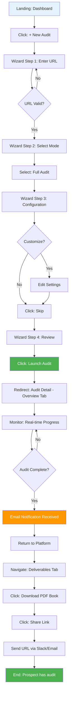
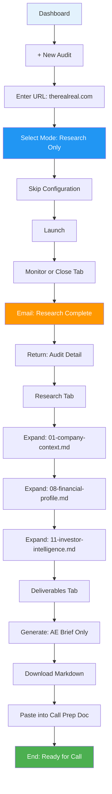
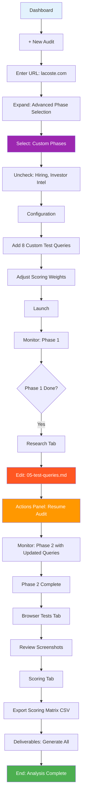
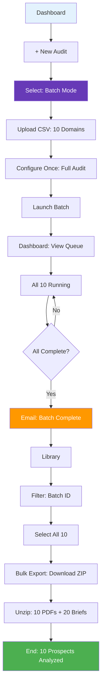
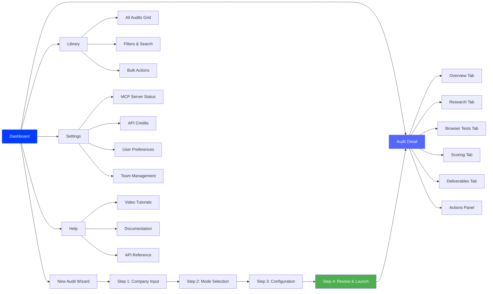
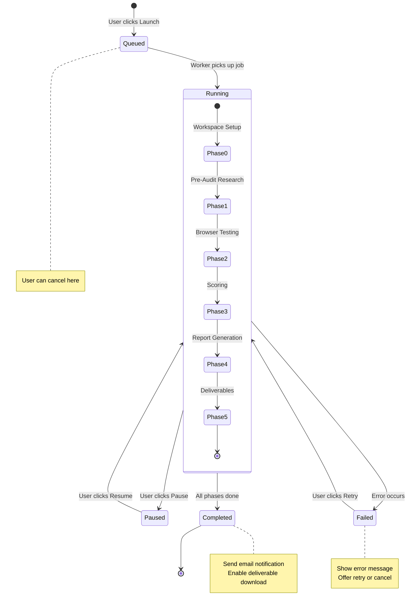
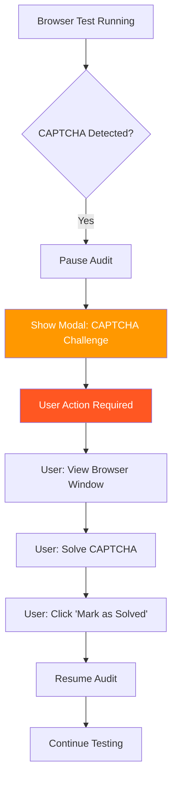
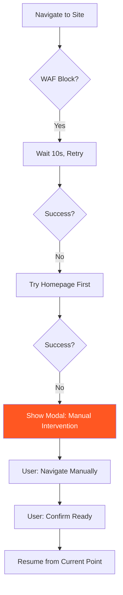
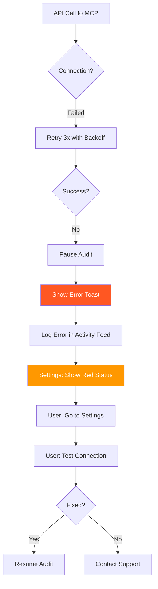

# Algolia Search Audit Dashboard — UX Flow Diagrams

**Date**: March 2, 2026

---

## User Flow 1: Marketing Manager — First Time Full Audit



**Key Touchpoints**: 8 screens, 3 clicks to launch, ~40 min wait, 2 clicks to share

---

## User Flow 2: Sales Engineer — Quick Research Mode



**Key Touchpoints**: 7 screens, 20 min wait, focused on scratchpad data

---

## User Flow 3: Product Marketing — Advanced Custom Audit



**Key Touchpoints**: 10+ screens, iterative editing, advanced controls

---

## User Flow 4: Partner Marketing — Batch Processing



**Key Touchpoints**: 6 screens, bulk operations, overnight processing

---

## Navigation Map: Information Architecture



---

## State Machine: Audit Lifecycle



---

## Screen-to-Screen Transitions

### From Dashboard
| Action | Destination | Transition Type |
|--------|-------------|-----------------|
| Click "+ New Audit" | Wizard Step 1 | Modal overlay |
| Click audit card | Audit Detail (Overview) | Full page |
| Click "View All" (Recent) | Library | Full page |
| Click "Settings" | Settings | Full page |
| Click "Profile" | User Profile | Dropdown menu |

### From Wizard
| Action | Destination | Transition Type |
|--------|-------------|-----------------|
| Click "Next" | Next wizard step | Slide animation |
| Click "Back" | Previous step | Slide animation |
| Click "Close X" | Dashboard | Modal closes |
| Click "Launch Audit" | Audit Detail (Overview) | Full page redirect |

### From Audit Detail
| Action | Destination | Transition Type |
|--------|-------------|-----------------|
| Click "← Back to Dashboard" | Dashboard | Full page |
| Click tab (Research, Browser, etc.) | Same page, tab change | Tab switch |
| Click "View" on scratchpad file | File detail modal | Modal overlay |
| Click "Download PDF" | File downloads | Browser download |
| Click "Share Link" | Share modal | Modal overlay |
| Click "Pause Audit" | Same page, status updates | In-place update |

### From Library
| Action | Destination | Transition Type |
|--------|-------------|-----------------|
| Click audit row | Audit Detail | Full page |
| Click "View" | Audit Detail | Full page |
| Click "Download" | File downloads | Browser download |
| Click "Share" | Share modal | Modal overlay |
| Click "Delete" | Confirm modal → refresh | Modal + update |

---

## Error Flows

### Error: CAPTCHA Detected (Phase 2)



### Error: WAF Block (Phase 2)



### Error: MCP Server Disconnected



---

## Interaction Patterns

### Real-Time Progress Updates

```
User View (Browser)          WebSocket           Backend Worker
       |                          |                      |
       |                          |<------ emit("phase.progress", data)
       |<------ message ----------|                      |
       | Update progress bar      |                      |
       | Show current step        |                      |
       |                          |                      |
       |                          |<------ emit("activity.log", data)
       |<------ message ----------|                      |
       | Append to activity feed  |                      |
       |                          |                      |
       |                          |<------ emit("audit.complete", data)
       |<------ message ----------|                      |
       | Show toast notification  |                      |
       | Enable deliverable links |                      |
```

### Scratchpad File Editing (Advanced)

```
1. User clicks "Edit" on 05-test-queries.md
   ↓
2. Modal opens with markdown editor
   ↓
3. User edits queries, adds 2 new ones
   ↓
4. User clicks "Save"
   ↓
5. API: PUT /audits/{id}/scratchpad/05-test-queries.md
   ↓
6. Backend: Validate markdown format
   ↓
7. Backend: Save to database
   ↓
8. Frontend: Show success toast
   ↓
9. Frontend: Show "Resume Audit" button
   ↓
10. User clicks "Resume Audit"
    ↓
11. API: POST /audits/{id}/resume?from_phase=2
    ↓
12. Backend: Re-run Phase 2 with updated queries
    ↓
13. WebSocket: Stream progress to user
```

---

## Key Screens by Persona

### Marketing Manager (Simplicity)
1. ⭐ Dashboard (quick start)
2. ⭐ Wizard Step 1 (URL only)
3. ⭐ Wizard Step 2 (Full Audit button)
4. ⭐ Audit Detail - Overview (monitor)
5. ⭐ Audit Detail - Deliverables (download PDF)

**Screens NOT needed**: Research tab, Browser Tests tab, Settings

---

### Sales Engineer (Speed)
1. ⭐ Dashboard
2. ⭐ Wizard (Research Only mode)
3. ⭐ Audit Detail - Research (scratchpad explorer)
4. ⭐ Audit Detail - Deliverables (AE Brief download)

**Screens NOT needed**: Browser Tests, Scoring, Configuration

---

### Product Marketing (Control)
1. ⭐ Dashboard
2. ⭐ Wizard - Advanced Mode (custom phases)
3. ⭐ Wizard - Configuration (custom queries, weights)
4. ⭐ Audit Detail - Research (edit scratchpad)
5. ⭐ Audit Detail - Browser Tests (screenshot review)
6. ⭐ Audit Detail - Scoring (export matrix)
7. ⭐ Audit Detail - Actions (resume/regenerate)

**Screens needed**: ALL screens + advanced controls

---

### Partner Marketing (Scale)
1. ⭐ Dashboard (queue view)
2. ⭐ Wizard - Batch Mode (CSV upload)
3. ⭐ Library (filter by batch)
4. ⭐ Library - Bulk Actions (export all)

**Screens NOT needed**: Individual audit details (batch summary only)

---

## Responsive Breakpoints

### Desktop (1440px+)
- Full 3-column layout (sidebar + main + detail panel)
- All features visible
- No collapsed menus

### Tablet (768px - 1439px)
- 2-column layout (main + detail panel)
- Sidebar collapses to hamburger menu
- Wizard becomes full-width

### Mobile (< 768px)
- Single column layout
- Stack all content vertically
- Bottom nav bar for main sections
- Simplified wizard (auto-skip Step 3)

---

## Animation & Transitions

| Element | Animation | Duration | Easing |
|---------|-----------|----------|--------|
| Modal open | Fade in + scale(0.95→1) | 200ms | ease-out |
| Modal close | Fade out + scale(1→0.95) | 150ms | ease-in |
| Wizard step forward | Slide left | 300ms | ease-in-out |
| Wizard step back | Slide right | 300ms | ease-in-out |
| Tab switch | Fade swap | 200ms | ease-in-out |
| Progress bar update | Width transition | 300ms | ease-out |
| Toast notification | Slide down from top | 250ms | ease-out |
| Audit card hover | Lift (shadow increase) | 150ms | ease-out |
| Button hover | Background darken | 100ms | ease-out |

---

## Accessibility Considerations

### Keyboard Navigation
- ✅ All buttons/links focusable with Tab
- ✅ Modal traps focus (Esc to close)
- ✅ Wizard: Enter = Next, Shift+Enter = Back
- ✅ Audit cards: Space/Enter to open

### Screen Readers
- ✅ All images have alt text
- ✅ Progress bars have aria-valuenow/min/max
- ✅ Status badges have aria-label (e.g., "Status: Running")
- ✅ Activity log has aria-live="polite" for updates

### Color Contrast
- ✅ All text meets WCAG AA (4.5:1 for body, 3:1 for large text)
- ✅ Status colors tested with Color Oracle (colorblind simulation)
- ✅ Never rely on color alone (icons + text)

### Focus Indicators
- ✅ 2px blue outline on all interactive elements
- ✅ Visible skip-to-main link

---

## Loading States

### Skeleton Screens (before data loads)

**Dashboard**:
```
┌─────────────────────────────────────┐
│  ▓▓▓▓▓▓▓  (skeleton header)         │
├─────────────────────────────────────┤
│  ┌───────────┐ ┌───────────┐       │
│  │░░░░░░░░░░░│ │░░░░░░░░░░░│       │
│  │░░░░░░░░░░░│ │░░░░░░░░░░░│       │
│  │░░░░░░░░░░░│ │░░░░░░░░░░░│       │
│  └───────────┘ └───────────┘       │
│                                     │
└─────────────────────────────────────┘
```

**Audit Detail - Research Tab**:
```
┌─────────────────────────────────────┐
│  ▓▓▓▓▓▓▓▓▓▓▓▓▓▓▓▓▓                  │
│  ┌─────────────────────────────────┐│
│  │ ░░░░░░░░░░░░░░░░░░░░░░░░░░░░░░ ││
│  │ ░░░░░░░░░░░░░░░░░░░░░░░░░░░░░░ ││
│  │ ░░░░░░░░░░░░░░░░░░░░░░░░░░░░░░ ││
│  └─────────────────────────────────┘│
└─────────────────────────────────────┘
```

### Spinners (inline operations)
- Small (16px): Inline with text (e.g., "Saving... ⏳")
- Medium (32px): Modal centers (e.g., "Generating PDF...")
- Large (64px): Full-page overlays (rare, only on initial load)

---

## Notification Strategy

### Email Notifications (User Preference)
- ✅ Audit started (optional, default OFF)
- ✅ Phase 1 complete (optional, default OFF)
- ✅ Audit complete (default ON)
- ✅ Audit failed (default ON)
- ✅ Batch complete (default ON)

### In-App Toasts
- ✅ Audit launched (success, 3s)
- ✅ Audit paused (info, 3s)
- ✅ Audit resumed (info, 3s)
- ✅ Error occurred (error, 5s + dismiss button)
- ✅ File downloaded (success, 2s)
- ✅ Link copied (success, 2s)

### Browser Push (Future)
- ⏳ Audit complete (when tab not focused)
- ⏳ User action required (CAPTCHA)

---

This flow diagram set provides the complete navigation structure, error handling patterns, and interaction models for the dashboard.
